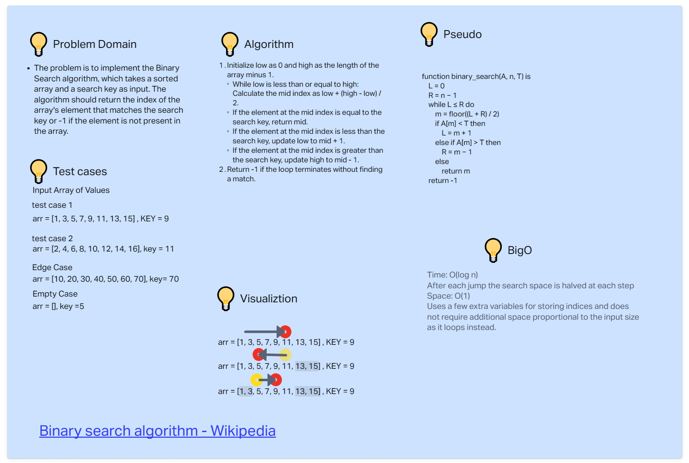

# Array Binary Search

Write a function which takes an array as an argument, return an array with elements in reversed order.

## Whiteboard Process



## Approach & Efficiency

tbd

## Solution

``` java

tbd

```