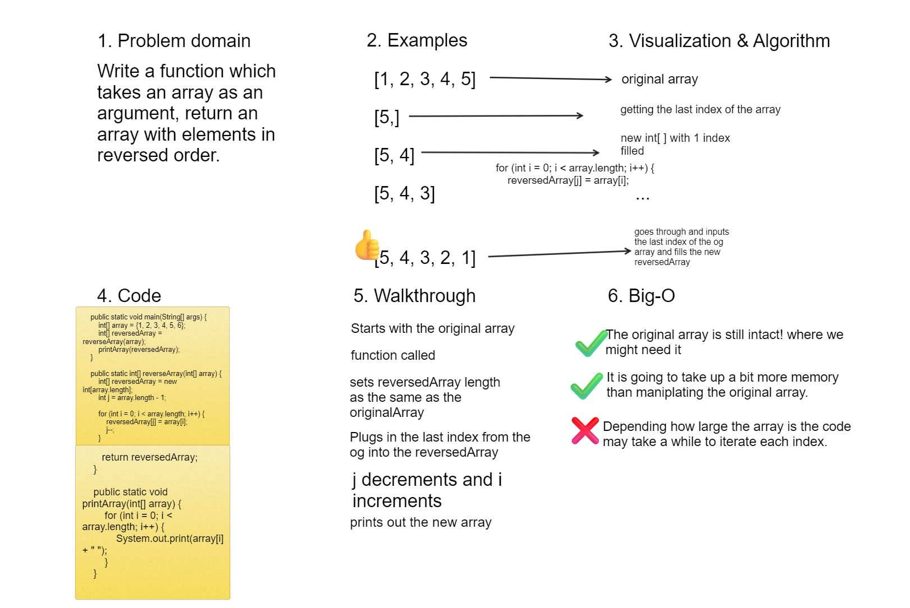

# Reverse Array

Write a function which takes an array as an argument, return an array with elements in reversed order.

## Whiteboard Process



## Approach & Efficiency

we went to the more robust route and made a new array, we thought we may need access to the original array. The time it takes to run it really dependent on how large the input array is.

## Solution

``` java

public class Main {
    public static void main(String[] args) {
        int[] array = {1, 2, 3, 4, 5, 6};
        int[] reversedArray = reverseArray(array);
        printArray(reversedArray);
    }

    public static int[] reverseArray(int[] array) {
        int[] reversedArray = new int[array.length];
        int j = array.length - 1;

        for (int i = 0; i < array.length; i++) {
            reversedArray[j] = array[i];
            j--;
        }

        return reversedArray;
    }

    public static void printArray(int[] array) {
        for (int i = 0; i < array.length; i++) {
            System.out.print(array[i] + " ");
        }
    }
}

```
