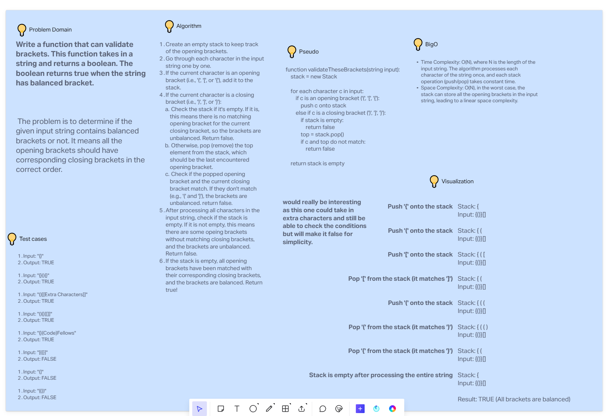

# Bracket Validation
Write a function that can validate brackets. This function takes in a string and returns a boolean. The boolean returns true when the string has balanced bracket.

## Whiteboard Process



## Testing
Testing file:dataStructures/lib/src/test/java/codeChallenge/bracketValidation/BracketValidationTest.java

testing can be done in this `test.java`.

## Approach & Efficiency


## Solution

```java
package codechallenge.bracketValidation;

import java.util.Stack;

public class bracketValidation {
    public static boolean validateBrackets(String input) {
        if (input == null || input.isEmpty()) {
            return true; // Empty string is considered balanced
        }

        Stack<Character> stack = new Stack<>();

        for (int i = 0; i < input.length(); i++) {
            char c = input.charAt(i); // iterates over the characters

            if (c == '(' || c == '[' || c == '{') {
                stack.push(c);// if any open brackets the iterator goes over, push that bracket into the stack.
            } else if (c == ')' || c == ']' || c == '}') {
                if (stack.isEmpty()) {
                    return false; // Closing bracket with no matching opening bracket should return false.
                }

                char top = stack.pop();
                if ((c == ')' && top != '(') || (c == ']' && top != '[') || (c == '}' && top != '{')) {
                    return false; // closing bracket doesn't match the top of the stack will return false
                }
            } else {
                // consider them as errors and return false.
                return false;
            }
        }

        return stack.isEmpty(); // All brackets should have a match and an empty stack, otherwise return false
    }
}
```
