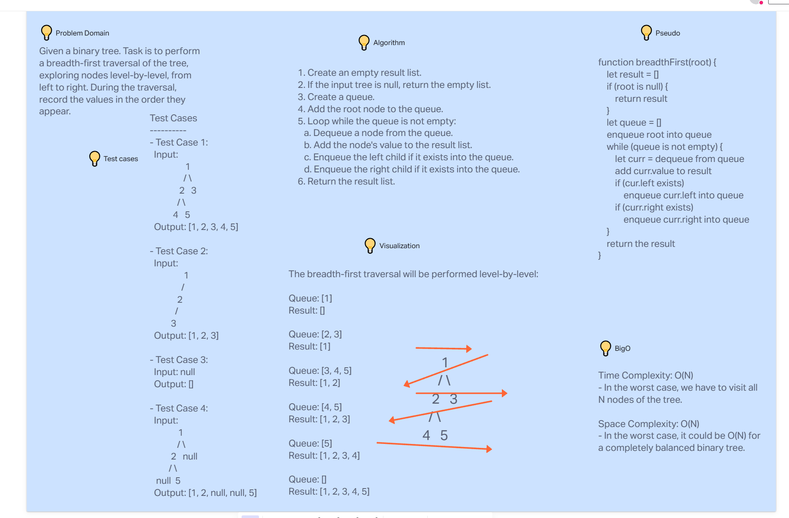

# Tree Breadth First

Binary Tree Breadth-First Traversal is a Java-based algorithm that performs a breadth-first traversal on a binary tree and returns a list of all its node values in the order they were encountered. The breadth-first traversal visits nodes level-by-level, exploring the tree horizontally.

The project includes a Java class TreeBreadthFirst with a method breadthFirst that implements the breadth-first traversal algorithm. The method takes the root node of the binary tree as input and returns a list of integers representing the values of the nodes visited during the traversal.

[//]: # (Description from CHATGPT)

## Whiteboard Process




## Approach & Efficiency


## Solution

``` java
public class TreeBreadthFirst {
    public List<Integer> breadthFirst(TreeNode root) {
        List<Integer> result = new ArrayList<>();
        if (root == null) {
            return result;
        }

        Queue<TreeNode> queue = new LinkedList<>();
        queue.offer(root);

        while (!queue.isEmpty()) {
            TreeNode curr = queue.poll();
            result.add(curr.val);

            if (curr.left != null) {
                queue.offer(curr.left);
            }

            if (curr.right != null) {
                queue.offer(curr.right);
            }
        }

        return result;
    }
}
```

## References
[Queue add vs offer](https://stackoverflow.com/questions/2703984/what-is-the-difference-between-the-add-and-offer-methods-in-a-queue-in-java)

[Queue Poll ](https://docs.oracle.com/javase/8/docs/api/java/util/Queue.html)
